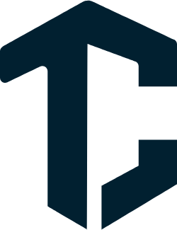

<div >
<h1 align="center">
    
</h1>

## 🔋 Sobre o projeto
    
O projeto Tomorrow's Code foi desenvolvido durante o segundo módulo do curso Fullstack Códigos do Amanhã, idealizado pelo EBANX e facilitado pela Resilia.Trata-se de uma plataforma de cursos online inovadora, com o objetivo de oferecer aos usuários uma experiência de aprendizado única e de qualidade. Buscamos fornecer conteúdos atualizados e instrutores especializados, alinhados com as demandas do mercado atual.

Para a construção da plataforma, utilizamos tecnologias como HTML, CSS e JavaScript, garantindo a criação de uma estrutura sólida e um layout responsivo. Além disso, incorporamos o framework Bootstrap para otimizar o design e proporcionar uma experiência visual agradável aos usuários.

A página do projeto conta com uma seção de introdução, onde ressaltamos a importância de despertar o potencial dos usuários e auxiliá-los a conquistar um futuro brilhante. Também incluímos uma lista de próximos cursos, onde os usuários têm a oportunidade de se inscrever na lista de espera, garantindo assim sua vaga nas próximas turmas. Utilizamos recursos como cards e botões de cadastro para facilitar a interação e a navegação dos usuários pela plataforma.

Ao longo do desenvolvimento do projeto, nossa equipe demonstrou uma grande organização, comprometimento e colaboração mútua. Seguimos um cronograma eficiente, trabalhando em conjunto para superar os desafios que surgiram durante o processo. Cada membro da equipe desempenhou um papel fundamental, contribuindo com suas habilidades e experiências para o sucesso do projeto..

O projeto Tomorrow's Code é resultado do esforço e dedicação da equipe de desenvolvimento, composta pelos membros Charlie, Denise, Juliene, Larissa e Victor. Estamos extremamente satisfeitos com o resultado alcançado e gratos por todo o aprendizado adquirido ao longo desse processo.

## 🤖 Stacks

Foi utilizado no projeto as stacks a seguir:

- [HTML][https://developer.mozilla.org/pt-BR/docs/Web/HTML]
- [CSS][https://developer.mozilla.org/pt-BR/docs/Web/CSS]
- [JavaScript][https://developer.mozilla.org/pt-BR/docs/Web/JavaScript]
- [BootStrap][https://getbootstrap.com/]
- [API][https://viacep.com.br/]

## 👽 Como executar o projeto
```bash
# Clone este repositório
$ git clone https://github.com/VictorVechi/tomorrows-code.git

# Acesse a pasta do projeto no terminal/cmd
$ cd tomorrows-code
```

DEVs: Charlie, Denise, Juliene, Larissa e Victor

</div>
